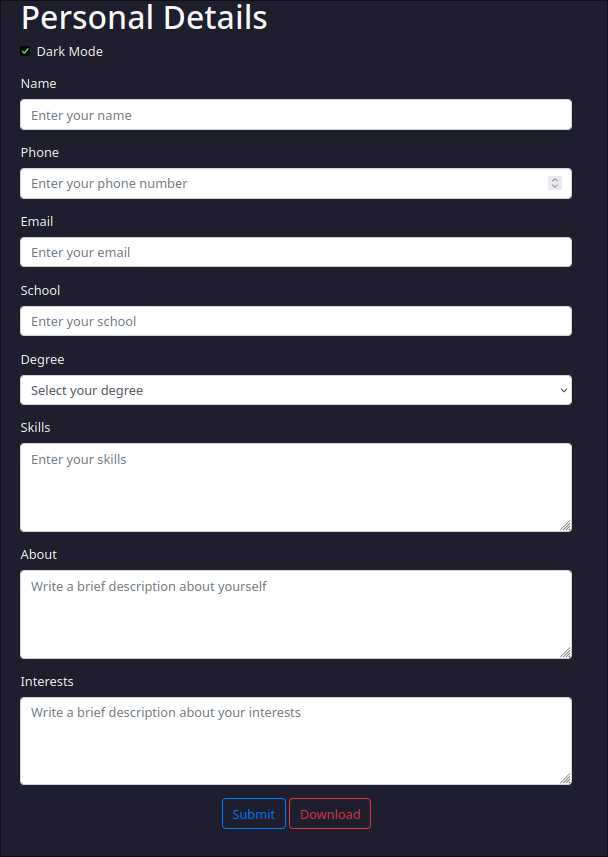

# 📜 ResuMate 
> **Note**

ResuMate is an automated resume generator, specially for those who dosent like to write their long resume

We wanted to provide you with an free to use, user-fiendly software and hopefully we have done that


## tools and lib used

For the creation if this tool, we have used html, css, bootstrap, and for backend, we have used python and django


The user does not require any login, thus they can create their reumes avoiding the login panel


### installation 
> **Warning**

need an external pkg `wkhtmltopdf`

for debian users type 
```sudo apt install wkhtmltopdf```

arch linux users ``` yay -S wkhtmltopdf-static``

then type the following 


```bash
python3 -m venv .env

source .env/bin/activate

pip3 install django pdfkit

```

for deploying
```
./manage.py createsuperuser

./manage.py migrate

./manage.py runserver
```

access the app via https://127.0.0.1:8000
